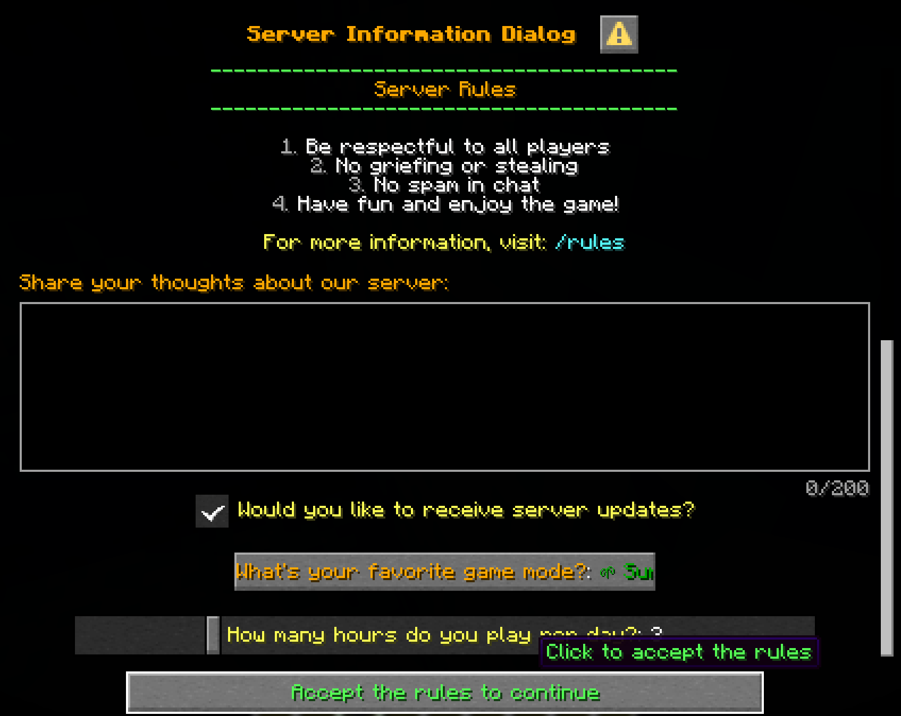
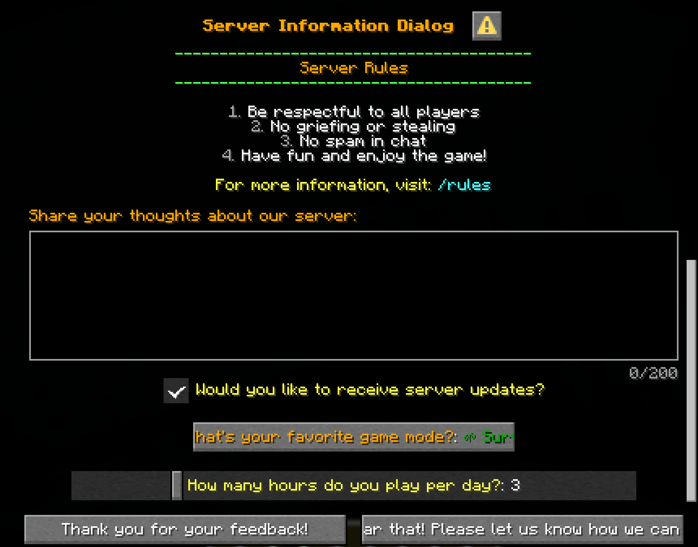
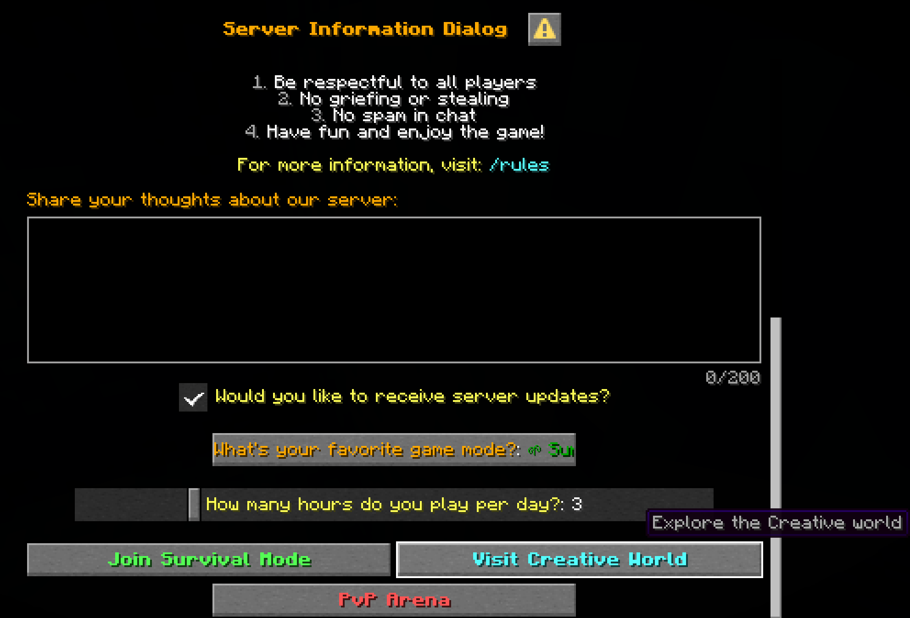
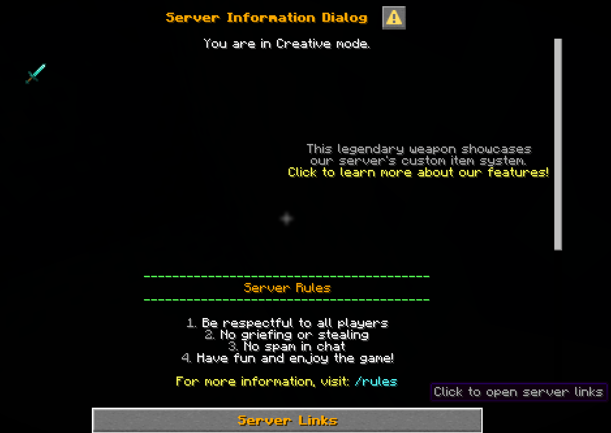

# Dialog Types

zMenu supports several types of dialogs, each designed for specific use cases. Choose the appropriate type based on what you want to achieve.

## Available Dialog Types

### `notice`
A simple informational dialog with a single "OK" or acknowledgment button.

**Best for:**
- Announcements and notifications
- Simple information display
- Rules and guidelines
- Welcome messages

**Example:**
```yaml
type: notice
notice:
  text: "<green>Accept the rules to continue"
  tooltip: "<green>Click to accept the rules"
  width: 300
```



### `confirmation`
A dialog with two options: Yes/No or Accept/Decline.

**Best for:**
- Confirming player actions
- Agreement to terms
- Binary choices
- Opt-in/opt-out situations

**Example:**
```yaml
type: confirmation
confirmation:
  yes-text: "I agree to the terms"
  yes-tooltip: "Click to accept"
  yes-width: 200
  no-text: "I decline"
  no-tooltip: "Click to decline"
  no-width: 200
```



### `multi_action`
A dialog with multiple custom action buttons.

**Best for:**
- Server navigation menus
- Multiple choice selections
- Game mode selection
- Feature access points

**Example:**
```yaml
type: multi_action
number-of-columns: 2
multi-actions:
  button1:
    text: "&a&lJoin Survival"
    tooltip: "&7Click to join Survival world"
    width: 200
  button2:
    text: "&b&lVisit Creative"
    tooltip: "&7Explore Creative world"
    width: 200
```



### `server_links`
A specialized dialog for displaying server-related links and external connections.

**Best for:**
- Server social media links
- External websites
- Discord invitations
- Community resources

**Example:**
```yaml
type: server_links
server-links:
  text: "&6&lServer Links"
  tooltip: "&7Click to open server links"
  width: 300
  number-of-columns: 2
```



## Choosing the Right Type

| Dialog Type | Use When | Button Count |
|------------|----------|--------------|
| `notice` | Simple information display | 1 (OK/Close) |
| `confirmation` | Yes/No decisions needed | 2 (Yes/No) |
| `multi_action` | Multiple custom options | 2+ (Custom) |
| `server_links` | External links needed | 2+ (Links) |

## Type-Specific Configuration

Each dialog type has its own specific configuration options. The `type` field determines which additional configuration sections are required and available for your dialog.